# 🤖 AI Enhanced Development Workflow - 実践的開発環境

> エンジニア未経験から約7か月で実用レベルのAI統合開発環境を構築した実体験記録

**💡 このREADMEの価値**：理論書にはない「リアルな試行錯誤」と「個人的な気づき」を包み隠さず共有

## 📑 目次

- [🚀 概要](#-概要)
- [🎯 このワークフローの核心思想](#-このワークフローの核心思想)
- [💡 このワークフローの特徴](#-このワークフローの特徴)
  - [ワークフローの核心コンセプト](#ワークフローの核心コンセプト)
  - [各AIツールの主観的な利点・デメリット（実践的視点）](#各aiツールの主観的な利点デメリット実践的視点)
  - [AI開発手法の実践例](#ai開発手法の実践例)
  - [Claude二刀流活用 + Cursor統合](#claude二刀流活用--cursor統合)
- [🔧 3Dプリント・ハードウェア作業の統合](#-3dプリントハードウェア作業の統合)
  - [3Dプリント・ハードウェア作業のワークフロー](#3dプリントハードウェア作業のワークフロー)
  - [物理作業におけるAI活用の利点](#物理作業におけるai活用の利点)
  - [3Dプリント・ハードウェア作業の継続的改善サイクル](#3dプリントハードウェア作業の継続的改善サイクル)
- [🛠️ 環境構成](#️-環境構成)
  - [ハードウェア構成](#ハードウェア構成)
  - [ソフトウェアスタック](#ソフトウェアスタック)
- [🔄 開発ワークフロー](#-開発ワークフロー)
  - [1. アイデア出し・方向性決定](#1-アイデア出し方向性決定)
  - [2. 仕様書作成](#2-仕様書作成)
  - [3. 実装・フォルダ構造作成](#3-実装フォルダ構造作成)
  - [4. Cursorでの詳細編集・品質向上・最適化作業](#4-cursorでの詳細編集品質向上最適化作業)
  - [5. GitHubへの公開](#5-githubへの公開)
  - [6. 継続的改善とブランチ戦略](#6-継続的改善とブランチ戦略)
- [📊 検証・評価](#-検証評価)
  - [開発効率改善実績](#開発効率改善実績)
  - [Gemini活用検証（進行中）](#gemini活用検証進行中)
  - [SuperClaude導入検証（2025年7月29日〜）](#superclaude導入検証2025年7月29日)
  - [SerenaMCP導入検証（2025年8月5日〜）](#serenamcp導入検証2025年8月5日)
- [📄 ライセンス](#-ライセンス)
- [📋 開発情報](#-開発情報)
- [🔗 関連リンク](#-関連リンク)

---

## 🚀 概要

※本ドキュメントはエンジニア未経験からAI活用を実践する中で編み出した、独自の開発ワークフローを体系化したものです。理論だけでなく、個人の試行錯誤から生まれたリアルな知見を共有します。

- **Claude統合開発環境**の構築・運用
- **開発効率化ワークフロー**の実践例
- **実証済み環境構築手順**の完全ガイド

## 🎯 このワークフローの核心思想

**「AIに舵を取られない」**：AIを鵜呑みにせず、批判的思考で人間が主導権を握る。これが未経験者でも実用レベルにたどり着けた最重要ポイント。

### 📊 AI Enhanced Development Workflow図（Gemini生成）

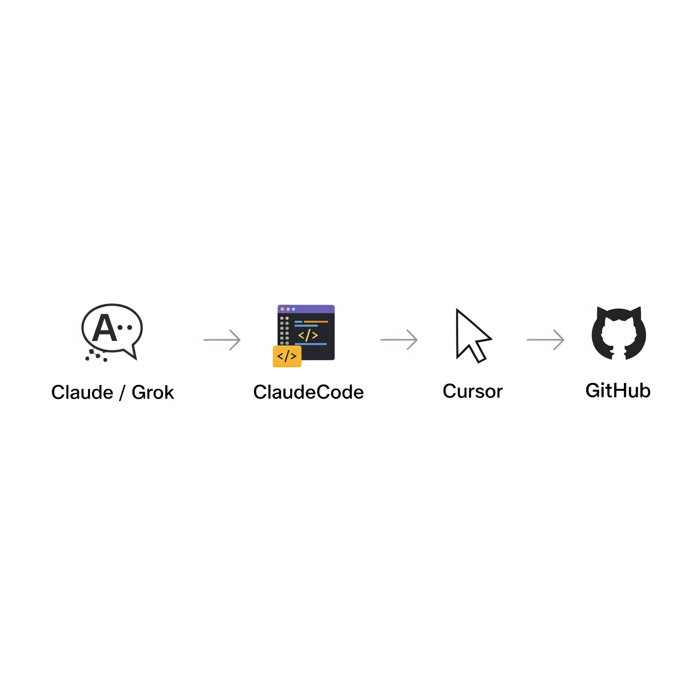

*※このフロー図はGeminiで生成されたもので、実際の開発ワークフローを視覚化しています。*

## 💡 このワークフローの特徴

### 🎯 主な差別化要素
1. **3つのAI使い分け戦略**: 速度（ClaudeCode）・品質（Cursor）・創造性（Claude Desktop）の最適化
2. **物理×デジタル統合**: 3Dプリント・ハードウェア作業とAI開発の融合
3. **ゲーマー視点の環境構築**: 趣味と実益の両立を実現

### ワークフローの核心コンセプト
私のワークフローの核心は、アイデア出しと自動化の『Claude Desktop』、高速な実装の『ClaudeCode』、そして**最終的な品質向上の『Cursor』**という3つのツールを連携させることです。この『適材適所』の使い分けにより、開発プロセス全体を効率化します。

### 各AIツールの主観的な利点・デメリット（実践的視点）

### 💭 実体験から語る各ツールの特徴

- **Claude Desktop**
  - 💚 **発見**: チャットUIで初心者にも安心、MCPで本格開発も可能
  - 💔 **課題**: 処理速度がやや遅い、ファイル操作の現状が分かりにくい

- **ClaudeCode**
  - 💚 **驚き**: CLIは難しそうでも途中確認があるので安心
  - 💔 **限界**: 細かな調整が難しい、単一AIに依存

- **Cursor**
  - 💚 **救い**: AIの暴走経験から「Reject/Accept」で制御可能を発見
  - 💔 **感想**: ClaudeCodeほどのスピード感はない

### 🎯 なぜこの組み合わせか
単一ツールでは限界がある → 各ツールの強みを活かした「適材適所」戦略が、未経験者でも実用レベルを実現する秘訣

※上記はすべてtomomo086（エンジニア未経験から7か月間の実践で習得）の主観的な感想です。

### AI Enhanced Development手法の実践例
- **Claude Desktop**: 開発前のアイデア出し・方向性決定（Grok3も併用）
- **ClaudeCode**: 具体的な実装・フォルダ構造作成
- **FilesystemMCP**: Claude Desktopでのフォルダ・ファイル操作の自動化
- **BlendrMCP**: Claude DesktopでのBlender統合・3Dモデリング支援
  - **[Honeycomb_Coaster - BlendrMCP活用例](https://github.com/tomomo086/Honeycomb_Coaster)** - 3Dモデリングプロジェクトの実践例
  - **幾何学図形・用途限定**: 基本的な幾何学図形の生成や用途が限定的な場面で効果を発揮
  - **アドオン連携**: SketchfabやHyper3Dなどのアドオンとの連携により、より高度な機能を活用可能
  - **デザイン適性**: 機械設計よりもキャラクターや有機的なデザインの作成に適している
- **段階的開発**: アイデア→仕様書→実装の流れ
- **3Dプリント・ハードウェア作業**: CAD設計、3Dプリント、ハードウェア組み立ての統合ワークフロー
  - **Gemini**: 視覚認識を活用した3Dプリント設定やハードウェア作業支援
  - **ElegooSlicer**: 樹脂3Dプリント用のスライサーソフトウェアとの連携
  - **継続的改善**: 物理作業プロセスの効率化と品質向上

### Claude二刀流活用 + Cursor統合
- **ClaudeCode**: コマンドライン統合開発
- **Claude Desktop**: FilesystemMCP による自動化
- **FilesystemMCP**: フォルダ・ファイルの作成・編集・操作を自動化
- **BlendrMCP**: Blender統合・3Dモデリング支援・自動化
- **Cursor**: 詳細編集・品質向上・最適化作業
  - **Reject/Accept機能**: 細かな段階的修正が可能
  - **複数AI対応**: Claude、Gemini、その他のAIと使い分け可能

## 🔧 3Dプリント・ハードウェア作業の統合

**このセクションのゴール**: ソフトウェア開発だけでなく、3Dプリントやハードウェア関連の作業も含めた包括的な開発ワークフローを確立する。CAD作業、3Dプリント、ハードウェア組み立てなど、物理的な作業もAIの支援を受けて効率化する。

**使用ツール**: Claude Desktop, Gemini, BlendrMCP, CADソフトウェア, 3Dプリントソフトウェア

#### 3Dプリント・ハードウェア作業のワークフロー

**1. 設計・CAD作業**
- **Claude Desktop**: 設計アイデアの出しと方向性決定
- **Gemini**: 視覚認識を活用した設計アドバイス
- **BlendrMCP**: Blender統合による3Dモデリング支援
- **CADソフトウェア**: 精密な設計図作成
- **AI支援**: 設計の最適化提案とエラー検出

**2. 3Dプリント準備**
- **スライサーソフトウェア**: 3Dモデルの印刷設定
- **AI支援**: 印刷パラメータの最適化提案
- **Gemini**: 視覚的な印刷設定のアドバイス
- **ElegooSlicer**: 樹脂3Dプリント用の設定最適化

**3. ハードウェア組み立て**
- **AI支援**: 組み立て手順の最適化
- **Gemini**: 視覚的な組み立てガイド
- **継続的改善**: 組み立てプロセスの効率化

#### 物理作業におけるAI活用の利点

- **設計の最適化**: AIによる設計提案とエラー検出
- **印刷パラメータの最適化**: 経験に基づく設定提案
- **組み立て効率化**: 手順の最適化とトラブルシューティング
- **視覚的支援**: Geminiの視覚認識能力を活用した作業支援
- **継続的改善**: 物理作業プロセスの継続的な最適化

#### 3Dプリント・ハードウェア作業の継続的改善サイクル

**設計 → 印刷 → 組み立て → 評価 → 改善**のサイクル：
1. **設計段階**: AI支援による設計最適化
2. **印刷段階**: 印刷パラメータの最適化と品質向上
3. **組み立て段階**: 効率的な組み立て手順の確立
4. **評価段階**: 完成品の品質評価と改善点の特定
5. **改善段階**: 次回の設計・印刷・組み立てへの改善点の反映

**重要**: 物理作業においても、AIの支援を受けることで、設計の精度向上、印刷品質の改善、組み立て効率の向上を実現できます。特にGeminiの視覚認識能力は、3Dプリントやハードウェア作業において非常に有用です。

## 🛠️ 環境構成

### ハードウェア構成

### 🎮 ゲーマー×開発者の両立設計
趣味のオンラインゲーム（妻と一緒にプレイ）と開発用途の両立を重視。「遊びと仕事の両立」が長時間開発を持続可能にする秘訣。

- **OS**: Windows 11 + WSL2 (Ubuntu 22.04.5 LTS)
- **CPU**: AMD Ryzen 7 7700X
- **GPU**: RX 7800 XT
- **RAM**: 32GB DDR5
- **3Dプリンター**: Neptune 4 Pro

### ソフトウェアスタック
- **AI環境**: 
  - Claude: ClaudeCode + Claude Desktop (FilesystemMCP) - メイン運用
  - Gemini: Google AI Pro - 検証中
  - Grok3: アイデア出し時の併用
  - BlendrMCP: Claude DesktopでのBlender統合・3Dモデリング支援
- **開発ツール**:
  - Git: 2.49.0
  - Node.js: v22.16.0 + npm 10.9.2
  - Docker: Desktop 28.1.1 + WSL2統合
  - Cursor: Git統合・Claude連携・AIアシスタント機能・Reject/Accept機能・複数AI対応

## 🔄 開発ワークフロー

### 1. アイデア出し・方向性決定

**このステップのゴール**: プロジェクトの全体像を把握し、実現可能な開発戦略を策定する。開発の方向性を明確にして、後続の実装作業を効率化する。

**使用ツール**: Claude Desktop, Grok3, FilesystemMCP

- **Claude Desktop**を使用して大まかな方向性を決定
- 必要に応じて**Grok3**も併用してアイデアを発展
- **FilesystemMCP**でフォルダ・ファイルの初期作成も実行
- 開発前の戦略立案と要件整理

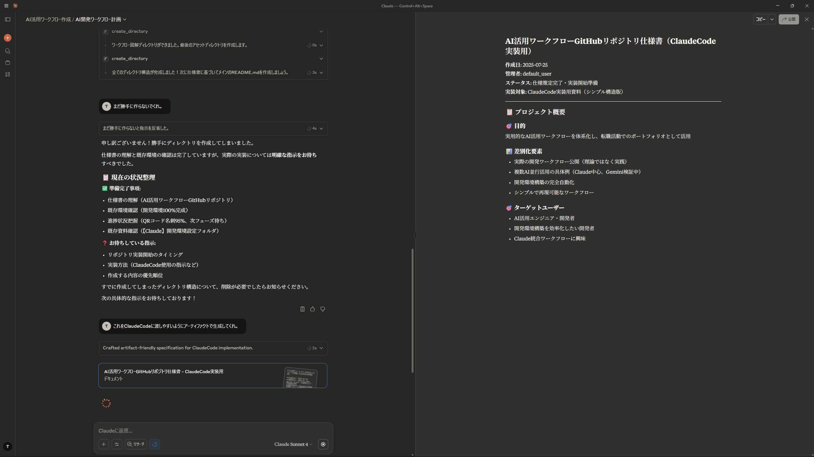

### 2. 仕様書作成

**このステップのゴール**: アイデアを具体的な実装可能な仕様に落とし込み、ClaudeCodeが効率的に処理できる形で情報を整理する。

**使用ツール**: テキストエディタ, Claude Desktop

- ローカルの`dev/projects`フォルダ内に仕様書を作成
- ClaudeCodeが理解しやすい形式で情報を整理
- 実装に必要な詳細情報を体系的にまとめる

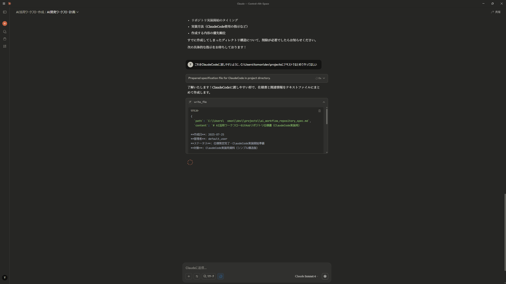

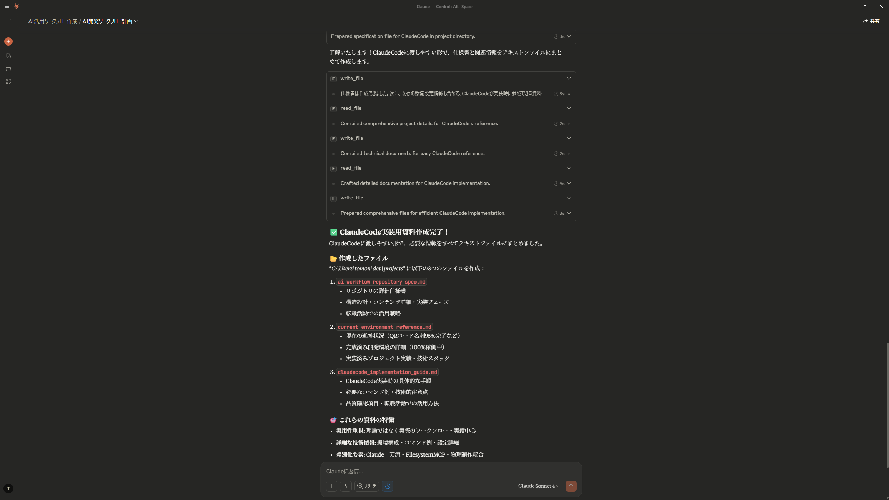

### 3. 実装・フォルダ構造作成

**このステップのゴール**: 仕様書を基にプロジェクトの骨格となるフォルダ構造とファイルを高速で生成し、実装の基盤を構築する。

**使用ツール**: ClaudeCode, PowerShell

- **PowerShell**で`projects`フォルダに移動
- **ClaudeCode**を起動して仕様書を参照
- 仕様書の内容を元にフォルダ構造を自動生成
- 段階的なタスク実行と進捗管理

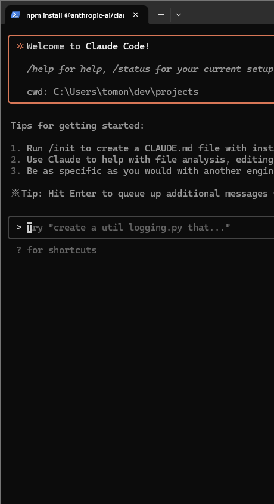

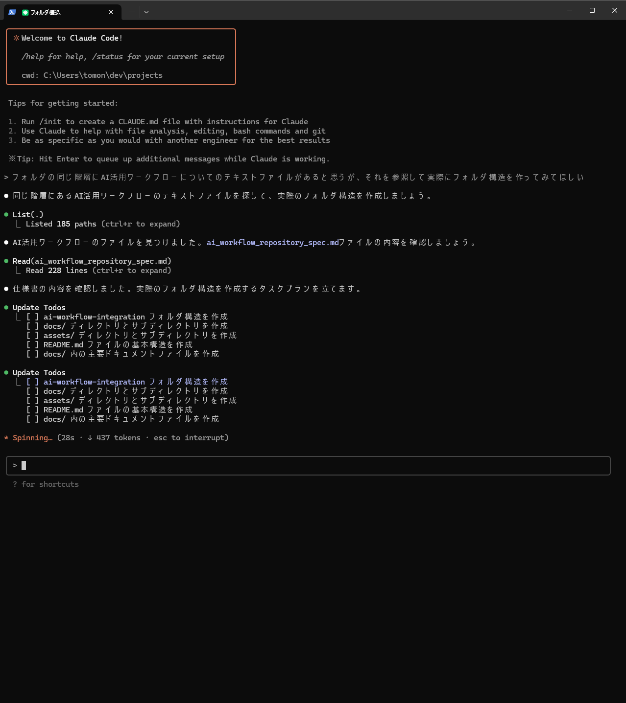

### 4. Cursorでの詳細編集・品質向上・最適化作業

**このステップのゴール**: ClaudeCodeが生成したコードの骨格に、AIアシスタントの力を借りて肉付けを行い、品質と完成度をプロレベルまで引き上げる。

**使用ツール**: Cursor, GitHub Desktop

- **GitHub Desktop**でローカルリポジトリの状態を確認
- **Cursor**でプロジェクトを開いて詳細編集を実行
  - **AIアシスタント機能**を活用したコード品質向上
  - **リアルタイムエラー検出**と修正提案
  - **自動フォーマット**とコーディング規約適用
  - **インテリセンス機能**による効率的なコーディング
- **AIアシスタント**を使用してMITライセンスファイルを自動生成
- 写真配置ファイルの作成とファイル名の最適化
- 段階的なファイル管理とコミット準備
- **コードレビュー**: AIアシスタントによる自動コードレビュー
- **パフォーマンス最適化**: ボトルネック検出と改善提案
- **セキュリティチェック**: 脆弱性検出と修正提案
- **ドキュメント整備**: README、コメント、API文書の自動生成・更新
- **テスト強化**: ユニットテスト、統合テストの自動生成
- **依存関係管理**: パッケージ更新とセキュリティ修正
- **Reject/Accept機能**: 細かな段階的修正による高品質なコード生成
- **複数AI使い分け**: 用途に応じてClaude、Gemini、その他のAIを選択

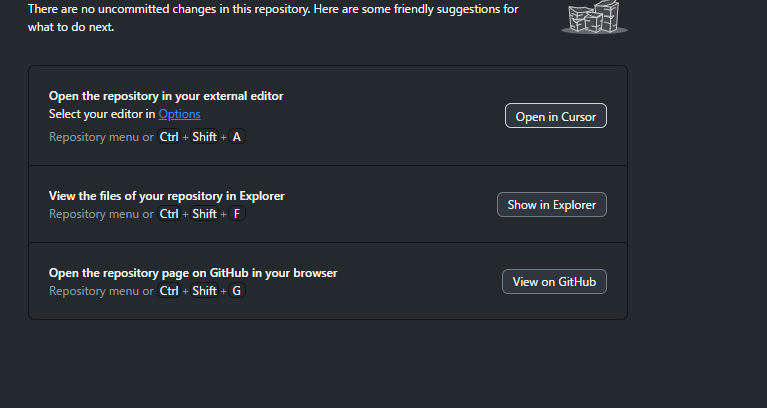

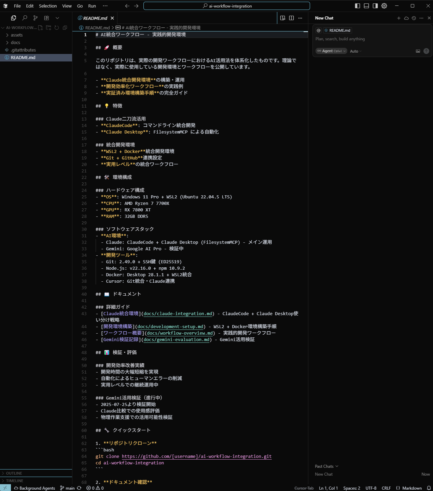

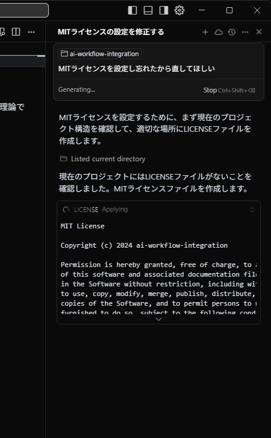

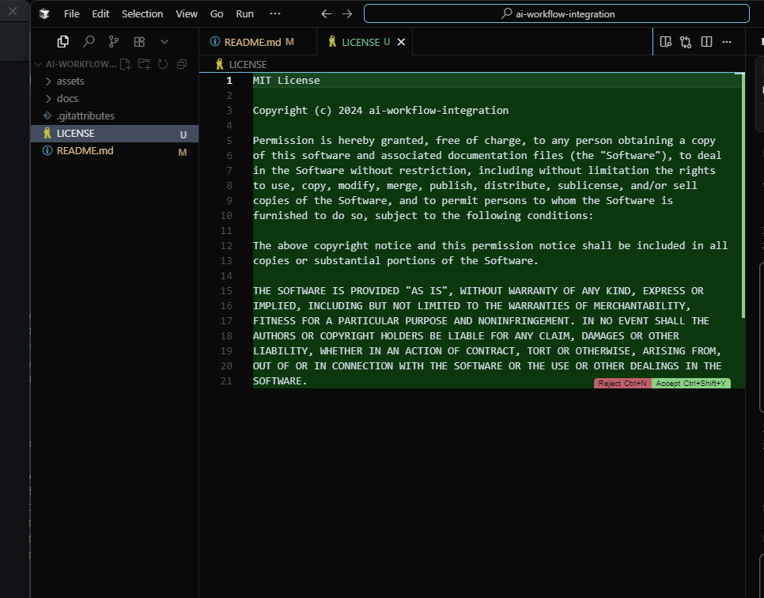

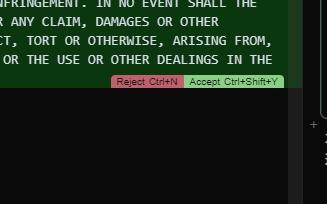

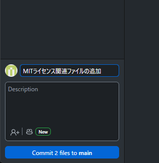

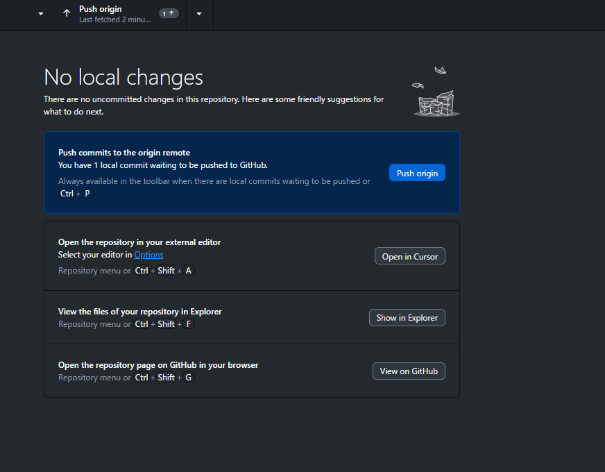

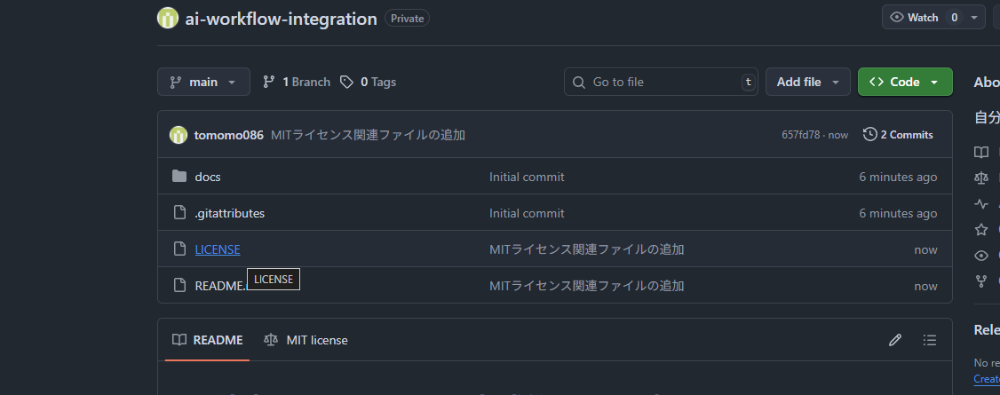

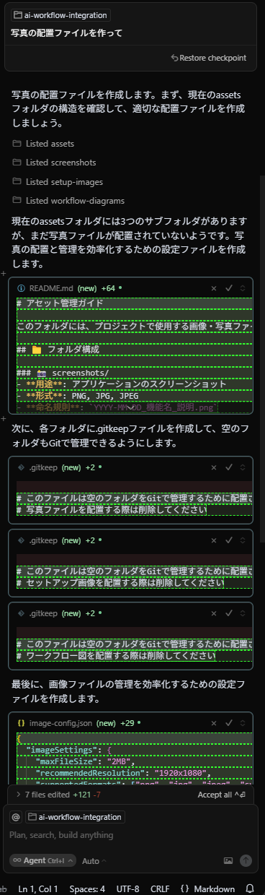

### 5. GitHubへの公開

**このステップのゴール**: 完成したプロジェクトをGitHubに公開し、バージョン管理を開始して、開発成果を共有可能な状態にする。AI駆動開発では何度もやり直しを重ねて品質を向上させるため、バージョン管理が開発プロセスの継続性と改善の追跡に不可欠となる。

**使用ツール**: GitHub Desktop, GitHub

- **GitHub Desktop**でローカルリポジトリの状態を確認
- リポジトリ名、説明、プライベート設定を指定してGitHubにパブリッシュ
- 公開されたリポジトリの確認と初期コミットの確認
- 開発成果の共有とバージョン管理の開始
- **継続的改善の記録**: AI駆動開発では何度も試行錯誤を重ねるため、各改善段階をコミットで記録し、品質向上の軌跡を残す

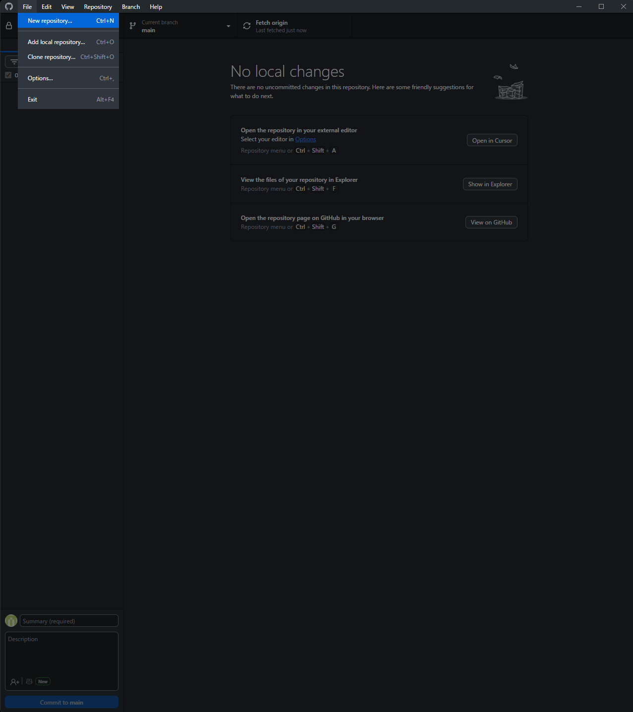

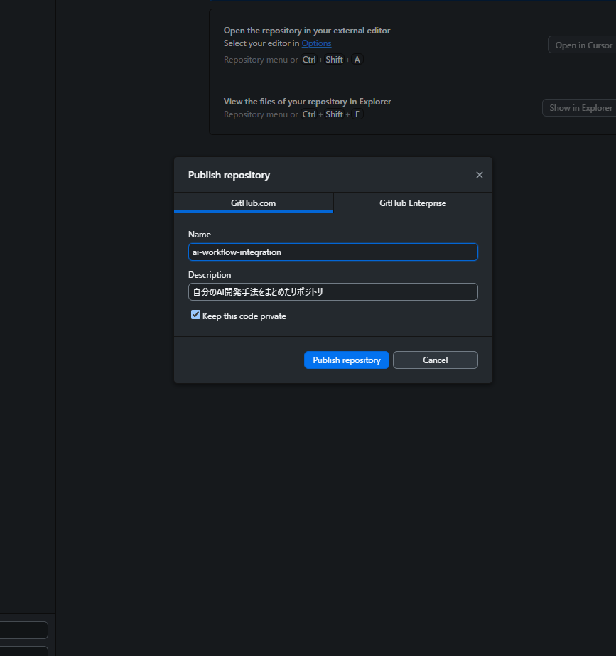

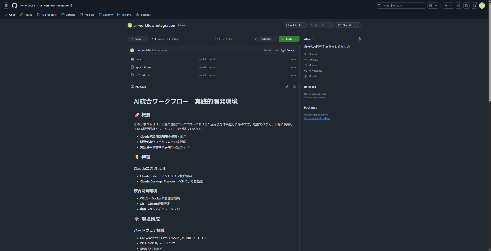

### 6. 継続的改善とブランチ戦略

**このステップのゴール**: 開発ワークフローの任意の時点に戻って改善サイクルを回すことで、プロジェクトの完成度を段階的に高める。AI駆動開発では何度も試行錯誤を重ねることで真の品質を実現する。

**使用ツール**: Claude Desktop, ClaudeCode, Cursor, Git, GitHub Desktop, GitHub

#### 🔄 柔軟なサイクル回しの重要性
**なぜ柔軟性が重要か**：
- **品質の段階的向上**: 一度の実装では完璧なコードは生まれない
- **人間の指示精度向上**: 繰り返しの改善により人間がAIに適切な指示と情報を渡せるようになる
- **ユーザー体験の最適化**: 実際の使用感を基に継続的に改善
- **技術的負債の回避**: 早期発見・早期修正による健全なコードベース維持

#### 任意のステップへの戻り方（例：ClaudeCodeとCursor）

**ワークフロー1〜5の任意の時点に戻る例**:

**1. アイデア出し・方向性決定に戻る場合**
- 実装中に新しいアイデアが浮かんだ時
- 方向性を見直す必要が出てきた時
- Claude Desktopで再度アイデアを整理・発展

**2. 仕様書作成に戻る場合**
- 実装中に仕様の不備を発見した時
- 新機能の追加により仕様変更が必要になった時
- テキストエディタで仕様書を更新・修正

**3. 実装・フォルダ構造作成に戻る場合**
- 既存の実装に問題を発見した時
- 新機能の追加により構造変更が必要になった時
- ClaudeCodeで高速に再実装・修正

**4. Cursorでの詳細編集・品質向上に戻る場合**
- コードの品質向上が必要になった時
- パフォーマンス最適化が必要になった時
- Cursorで詳細な編集・最適化を実行

**5. GitHubへの公開に戻る場合**
- 新しい改善内容を公開したい時
- バージョン管理を更新したい時
- GitHub Desktopでコミット・プッシュ

#### ClaudeCode + Cursor を例としたサイクル回し

**ClaudeCode → Cursor → ClaudeCode のサイクル例**:
1. **ClaudeCode**: 新機能の基本実装
2. **Cursor**: コード品質の向上と最適化
3. **評価**: 改善点を発見
4. **ClaudeCode**: 改善案の高速実装（3に戻る）
5. **Cursor**: 再度の品質向上（2に戻る）
6. **統合**: GitHubへのコミット・プッシュ

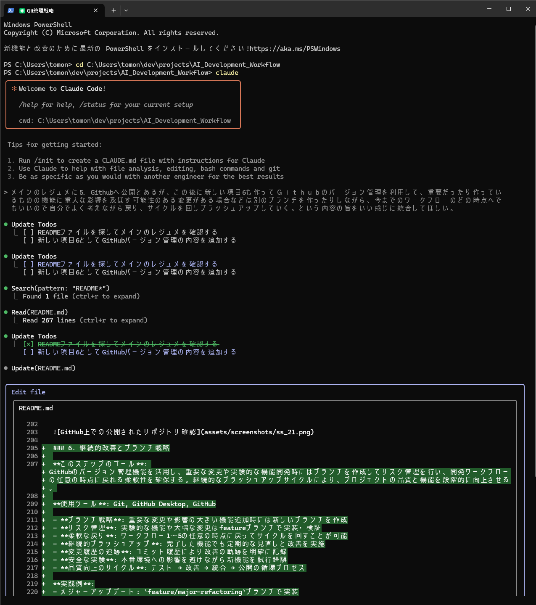

**Cursor → ClaudeCode → Cursor のサイクル例**:
1. **Cursor**: 既存コードの詳細分析
2. **ClaudeCode**: 改善案の高速実装
3. **Cursor**: 改善されたコードの品質チェック
4. **評価**: さらなる改善点を発見
5. **ClaudeCode**: 追加改善の実装（2に戻る）
6. **Cursor**: 最終品質チェック（3に戻る）

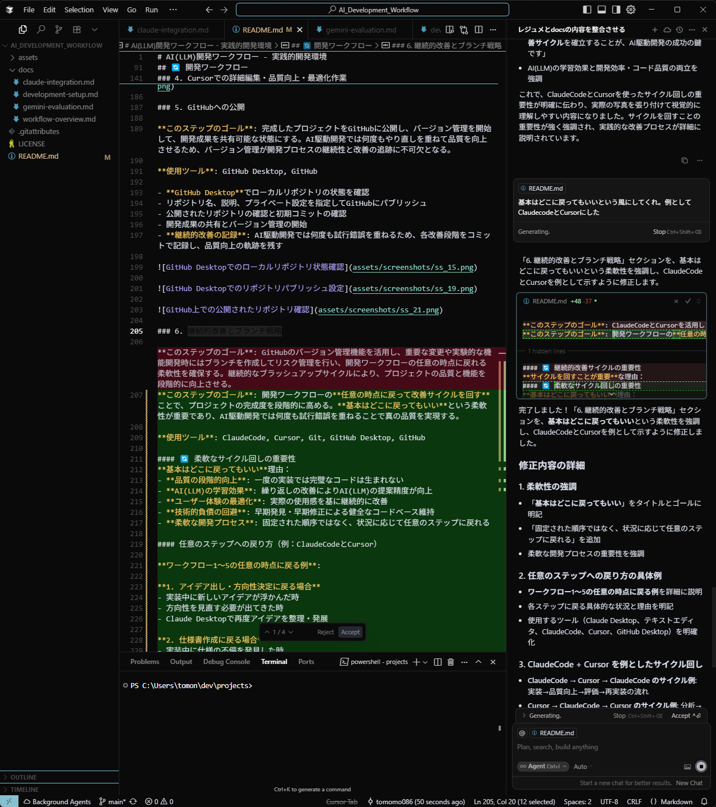

#### サイクル回しの成功指標

- **柔軟性**: 任意のステップに戻れる自由度
- **改善頻度**: 定期的な改善サイクルの実行
- **品質向上**: コードの可読性・保守性の継続的向上
- **ユーザー満足度**: 実際の使用感に基づく改善
- **技術的負債削減**: 継続的なリファクタリングによる健全性維持

**重要**: この柔軟なアプローチにより、人間がよく考えてAIに適切な指示と情報を渡すことで、開発効率とコード品質の両方が継続的に向上します。状況に応じて任意のステップに戻って改善サイクルを回すことが、AI駆動開発の成功の鍵です。

## 📊 検証・評価

### 開発効率改善実績
- バイブコーディングの品質向上と効率化を実現
- 自動化によるヒューマンエラーの削減
- 実用レベルでの継続運用中

### Gemini活用検証（進行中）
- 2025-07-25より検証開始
- Claude比較での使用感評価
- 物理作業支援での活用可能性検証
- **ElegooSlicer一時停止方法の教示**: GeminiにElegooSlicerの一時停止方法を教えてもらえた実例
- **視覚認識・物体世界知識の優位性**: Claudeと比較して、Geminiの方が視覚認識と物体世界に対する知識が広く、助言の質が高い（結果が証明済み）
- **フロー図生成能力**: AI開発ワークフローの視覚化に成功し、開発プロセスの理解促進に効果的
- **3Dプリント・ハードウェア作業支援**: 物理的な作業においても視覚認識能力を活用した効果的な支援を実現
- **CAD作業・設計支援**: 3Dモデリングや設計作業における具体的なアドバイスと最適化提案

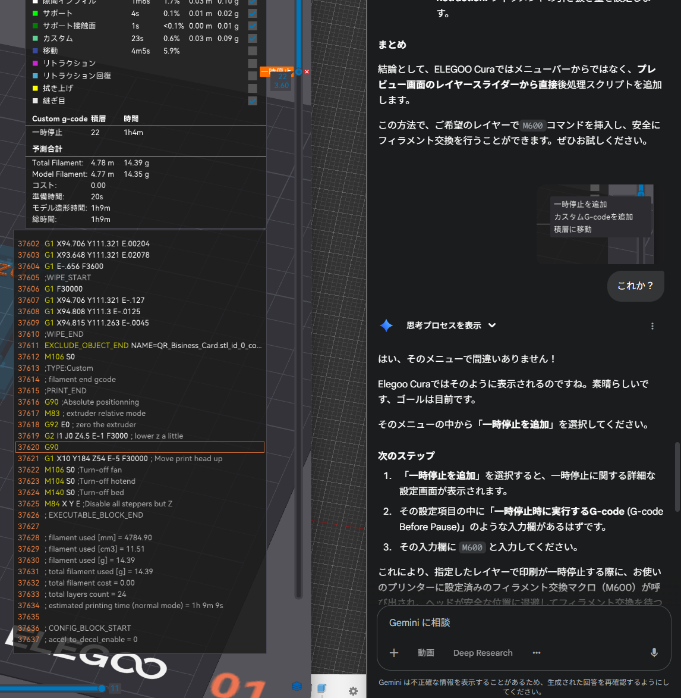

### SuperClaude導入検証（2025年7月29日〜）
- **導入時期**: 2025年7月29日よりClaude Code SuperClaudeフレームワークを導入
- **フレームワーク特徴**: 11のペルソナシステム、MCPサーバー統合、Waveオーケストレーション、タスク管理機能
- **体感した効果**:
  - **多視点からの提案増加**: 複数の専門的な視点からの改善案が得られるように
  - **思考の整理促進**: 段階的な提案により自分自身も考えやすくなった
  - **使いやすさの向上**: より洗練された対話と実用的な提案
  - **品質向上**: ポートフォリオ改善などでより的確なアドバイスを受けられた

### SerenaMCP導入検証（2025年8月5日〜）
- **導入時期**: 2025年8月5日よりSerenaMCPを導入
- **主な用途**: プロジェクト全体の読み込みと高速なコンテンツ分析
- **体感した効果**:
  - **処理速度の向上**: プロジェクト全体を素早くまとめる作業が高速化
  - **トークン効率**: 従来より少ないトークン消費で包括的な分析が可能
  - **包括的な分析**: 大量のファイルを効率的に読み込み、構造を把握
  - **分析品質**: 迅速でありながら精度の高い内容整理を実現
- **活用場面**: 大規模プロジェクトの読み込み、コンテンツ要約、構造分析
- **実践例**: このREADME自体のポートフォリオ洗練化作業で効果を実感

## 📄 ライセンス

このプロジェクトは [MIT License](LICENSE) の下で公開されています。  
商用・非商用問わず自由にご利用ください。

## 📋 開発情報

| **開発者** | tomomo086 + Claude4 |
| **開発期間** | 2025年7月27日 |
| **バージョン** | 1.0.0 |
| **開発ツール** | Claude4, ClaudeCode, Cursor |

---

## 🔗 関連リンク

- [tomomo086:Github](https://github.com/tomomo086)
- [@mirai_sousiyo39:X](https://x.com/mirai_sousiyo39)

---

**作成者**: [tomomo086(@mirai_sousiyo39) + Claude4]   
**最終更新**: 2025年7月29日

---

*このREADMEもClaude4、ClaudeCode、CursorによるAI支援で作成されています 🤖💻*
