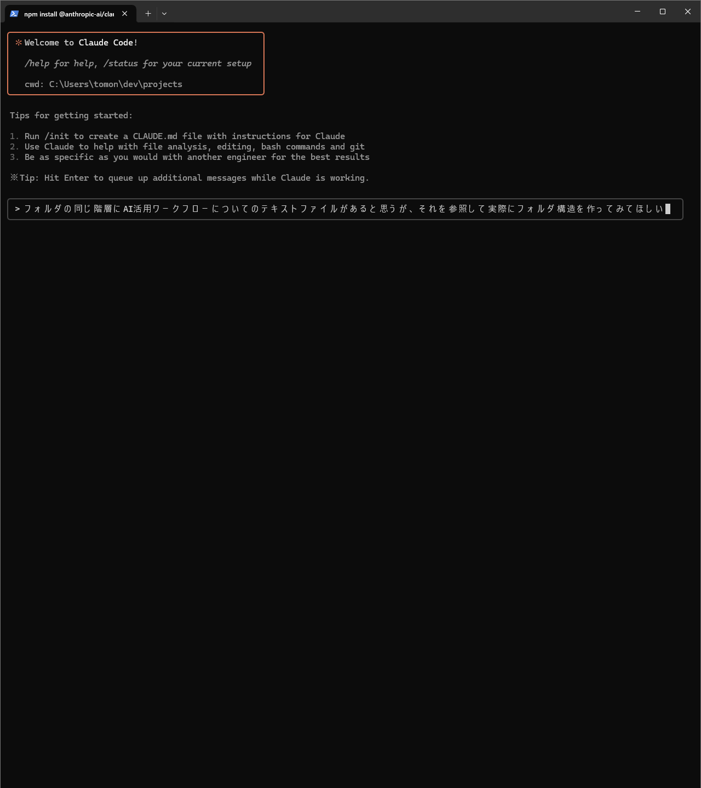

# AI統合ワークフロー - 実践的開発環境

## 🚀 概要

このリポジトリは、実際の開発ワークフローにおけるAI活用法を体系化したものです。理論ではなく、実際に使用している開発環境とワークフローを公開しています。

- **Claude統合開発環境**の構築・運用
- **開発効率化ワークフロー**の実践例
- **実証済み環境構築手順**の完全ガイド

## 💡 特徴

### AI開発手法の実践例
- **Claude Desktop**: 開発前のアイデア出し・方向性決定（Grok3も併用）
- **ClaudeCode**: 具体的な実装・フォルダ構造作成
- **段階的開発**: アイデア→仕様書→実装の流れ

### Claude二刀流活用
- **ClaudeCode**: コマンドライン統合開発
- **Claude Desktop**: FilesystemMCP による自動化

### 統合開発環境
- **WSL2 + Docker**統合開発環境
- **Git + GitHub**連携設定
- **実用レベル**の統合ワークフロー

## 🛠️ 環境構成

### ハードウェア構成
- **OS**: Windows 11 Pro + WSL2 (Ubuntu 22.04.5 LTS)
- **CPU**: AMD Ryzen 7 7700X
- **GPU**: RX 7800 XT
- **RAM**: 32GB DDR5

### ソフトウェアスタック
- **AI環境**: 
  - Claude: ClaudeCode + Claude Desktop (FilesystemMCP) - メイン運用
  - Gemini: Google AI Pro - 検証中
  - Grok3: アイデア出し時の併用
- **開発ツール**:
  - Git: 2.49.0 + SSH鍵 (ED25519)
  - Node.js: v22.16.0 + npm 10.9.2
  - Docker: Desktop 28.1.1 + WSL2統合
  - Cursor: Git統合・Claude連携

## 🔄 開発ワークフロー

### 1. アイデア出し・方向性決定
- **Claude Desktop**を使用して大まかな方向性を決定
- 必要に応じて**Grok3**も併用してアイデアを発展
- 開発前の戦略立案と要件整理


### 2. 仕様書作成
- ローカルの`dev/projects`フォルダ内に仕様書を作成
- ClaudeCodeが理解しやすい形式で情報を整理
- 実装に必要な詳細情報を体系的にまとめる


### 3. 実装・フォルダ構造作成
- **PowerShell**で`projects`フォルダに移動
- **ClaudeCode**を起動して仕様書を参照
- 仕様書の内容を元にフォルダ構造を自動生成
- 段階的なタスク実行と進捗管理





### 4. 継続的開発
- 作成された構造を基に詳細実装
- 必要に応じてClaude DesktopとClaudeCodeを併用
- 実用レベルでの継続運用


## 📖 ドキュメント

### 詳細ガイド
- [Claude統合環境](docs/claude-integration.md) - ClaudeCode + Claude Desktop使い分け戦略
- [開発環境構築](docs/development-setup.md) - WSL2 + Docker環境構築手順
- [ワークフロー概要](docs/workflow-overview.md) - 実践的開発ワークフロー
- [Gemini検証記録](docs/gemini-evaluation.md) - Gemini活用検証

## 📊 検証・評価

### 開発効率改善実績
- 開発時間の大幅短縮を実現
- 自動化によるヒューマンエラーの削減
- 実用レベルでの継続運用中

### Gemini活用検証（進行中）
- 2025-07-25より検証開始
- Claude比較での使用感評価
- 物理作業支援での活用可能性検証

## 🔧 クイックスタート

1. **リポジトリクローン**
```bash
git clone https://github.com/[username]/ai-workflow-integration.git
cd ai-workflow-integration
```

2. **ドキュメント確認**
- [開発環境構築ガイド](docs/development-setup.md)を参照
- 環境に応じて設定手順を実行

3. **Claude統合設定**
- [Claude統合環境ガイド](docs/claude-integration.md)を参照
- ClaudeCode + Claude Desktop設定

## 🎯 対象ユーザー

- **AI活用エンジニア・開発者**
- **開発環境構築を効率化したい開発者**
- **Claude統合ワークフローに興味がある制作者**
- **段階的AI開発手法を学びたい開発者**

## 📝 ライセンス

このプロジェクトはMITライセンスの下で公開されています。詳細は[LICENSE](LICENSE)ファイルを参照してください。

## 🤝 コントリビューション

このリポジトリは主に個人の開発ワークフロー記録ですが、改善提案や質問はIssueでお気軽にどうぞ。

---

**実際の開発環境で使用している設定とワークフローを公開しています。転職活動でのポートフォリオとしても活用中。**