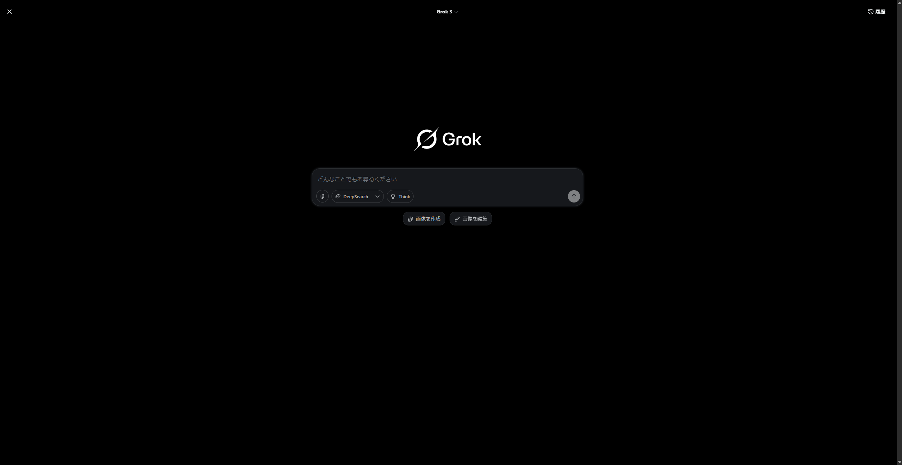

# AI(LLM)開発ワークフロー - 実践的開発環境

## 🚀 概要

※本ドキュメントはエンジニア未経験からAI(LLM)活用を実践する中で編み出した、独自の開発ワークフローを体系化したものです。理論だけでなく、個人の試行錯誤から生まれたリアルな知見を共有します。

- **Claude統合開発環境**の構築・運用
- **開発効率化ワークフロー**の実践例
- **実証済み環境構築手順**の完全ガイド

### 📊 AI(LLM)開発ワークフロー図（Gemini生成）

*※このフロー図はGeminiで生成されたもので、実際の開発ワークフローを視覚化しています。*

### ⚠️ 重要な注意事項
**AI(LLM)全般について**: AI(LLM)が教えてくれることを鵜呑みにせず、批判的思考を忘れずに自分でも調べてAI(LLM)の舵を取ることが、正しい答えにたどり着く方法だと思いました。AI(LLM)は強力なツールですが、人間の判断と検証が不可欠です。

## 💡 特徴

### ワークフローの核心コンセプト
私のワークフローの核心は、アイデア出しと自動化の『Claude Desktop』、高速な実装の『ClaudeCode』、そして**最終的な品質向上の『Cursor』**という3つのツールを連携させることです。この『適材適所』の使い分けにより、開発プロセス全体を効率化します。

### 各AI(LLM)ツールの主観的な利点・デメリット（実践的視点）

- **Claude Desktop**
  - 利点: チャットUIで視認性が高く直感的に対話可能／MCPによる拡張性で万能性あり／ZapierMCP連携でGoogleドライブ等にスマホからもアクセスしやすい
  - デメリット: 処理速度がやや遅い／ファイル操作の現状が分かりにくい／途中停止は強制ストップが必要

- **ClaudeCode**
  - 利点: CLIベースで処理が速い／操作中のファイルが可視化される／途中で許可を求めてくるので進捗管理しやすい
  - デメリット: Cursorほど細かな調整ができない／CLIは初心者には複雑／視覚的に分かりにくい

- **Cursor**
  - 利点: Reject/Acceptによる細かな段階的修正／複数AI(LLM)を使い分け可能／リアルタイムエラー検出や自動フォーマットなど細やかな品質向上が可能
  - デメリット: ClaudeCodeほどのスピード感はない／AI(LLM)の提案精度はプロンプトや文脈に依存する場合あり

※上記はすべてtomomo086（エンジニア未経験から実践で習得）の主観的な感想です。

### AI(LLM)開発手法の実践例
- **Claude Desktop**: 開発前のアイデア出し・方向性決定（Grok3も併用）
- **ClaudeCode**: 具体的な実装・フォルダ構造作成
- **FilesystemMCP**: Claude Desktopでのフォルダ・ファイル操作の自動化
- **BlendrMCP**: Claude DesktopでのBlender統合・3Dモデリング支援
  - **[Cutlery_Case - BlendrMCP活用例](https://github.com/tomomo086/Cutlery_Case/tree/main)** - 3Dモデリングプロジェクトの実践例
  - **幾何学図形・用途限定**: 基本的な幾何学図形の生成や用途が限定的な場面で効果を発揮
  - **アドオン連携**: SketchfabやHyper3Dなどのアドオンとの連携により、より高度な機能を活用可能
  - **デザイン適性**: 機械設計よりもキャラクターや有機的なデザインの作成に適している
- **段階的開発**: アイデア→仕様書→実装の流れ

### Claude二刀流活用 + Cursor統合
- **ClaudeCode**: コマンドライン統合開発
- **Claude Desktop**: FilesystemMCP による自動化
- **FilesystemMCP**: フォルダ・ファイルの作成・編集・操作を自動化
- **BlendrMCP**: Blender統合・3Dモデリング支援・自動化
- **Cursor**: 詳細編集・品質向上・最適化作業
  - **Reject/Accept機能**: 細かな段階的修正が可能
  - **複数AI(LLM)対応**: Claude、Gemini、その他のAI(LLM)と使い分け可能

### 統合開発環境
- **WSL2 + Docker**統合開発環境
- **Git + GitHub**連携設定
- **実用レベル**の統合ワークフロー

## 🛠️ 環境構成

### ハードウェア構成

※このPC構成は、趣味であるオンラインゲームを快適に楽しみ、妻とも一緒にプレイできる性能を重視しつつ、開発用途とも両立できるバランスを意識しています。

- **OS**: Windows 11 + WSL2 (Ubuntu 22.04.5 LTS)
- **CPU**: AMD Ryzen 7 7700X
- **GPU**: RX 7800 XT
- **RAM**: 32GB DDR5

### ソフトウェアスタック
- **AI(LLM)環境**: 
  - Claude: ClaudeCode + Claude Desktop (FilesystemMCP) - メイン運用
  - Gemini: Google AI(LLM) Pro - 検証中
  - Grok3: アイデア出し時の併用
  - BlendrMCP: Claude DesktopでのBlender統合・3Dモデリング支援
- **開発ツール**:
  - Git: 2.49.0 + SSH鍵 (ED25519)
  - Node.js: v22.16.0 + npm 10.9.2
  - Docker: Desktop 28.1.1 + WSL2統合
  - Cursor: Git統合・Claude連携・AI(LLM)アシスタント機能・Reject/Accept機能・複数AI(LLM)対応

## 🔄 開発ワークフロー

### 1. アイデア出し・方向性決定

**このステップのゴール**: プロジェクトの全体像を把握し、実現可能な開発戦略を策定する。開発の方向性を明確にして、後続の実装作業を効率化する。

**使用ツール**: Claude Desktop, Grok3, FilesystemMCP

- **Claude Desktop**を使用して大まかな方向性を決定
- 必要に応じて**Grok3**も併用してアイデアを発展
- **FilesystemMCP**でフォルダ・ファイルの初期作成も実行
- 開発前の戦略立案と要件整理

### 2. 仕様書作成

**このステップのゴール**: アイデアを具体的な実装可能な仕様に落とし込み、ClaudeCodeが効率的に処理できる形で情報を整理する。

**使用ツール**: テキストエディタ, Claude Desktop

- ローカルの`dev/projects`フォルダ内に仕様書を作成
- ClaudeCodeが理解しやすい形式で情報を整理
- 実装に必要な詳細情報を体系的にまとめる

### 3. 実装・フォルダ構造作成

**このステップのゴール**: 仕様書を基にプロジェクトの骨格となるフォルダ構造とファイルを高速で生成し、実装の基盤を構築する。

**使用ツール**: ClaudeCode, PowerShell

- **PowerShell**で`projects`フォルダに移動
- **ClaudeCode**を起動して仕様書を参照
- 仕様書の内容を元にフォルダ構造を自動生成
- 段階的なタスク実行と進捗管理

### 4. Cursorでの詳細編集・品質向上・最適化作業

**このステップのゴール**: ClaudeCodeが生成したコードの骨格に、AIアシスタントの力を借りて肉付けを行い、品質と完成度をプロレベルまで引き上げる。

**使用ツール**: Cursor, GitHub Desktop

- **GitHub Desktop**でローカルリポジトリの状態を確認
- **Cursor**でプロジェクトを開いて詳細編集を実行
  - **AI(LLM)アシスタント機能**を活用したコード品質向上
  - **リアルタイムエラー検出**と修正提案
  - **自動フォーマット**とコーディング規約適用
  - **インテリセンス機能**による効率的なコーディング
- **AI(LLM)アシスタント**を使用してMITライセンスファイルを自動生成
- 写真配置ファイルの作成とファイル名の最適化
- 段階的なファイル管理とコミット準備
- **コードレビュー**: AI(LLM)アシスタントによる自動コードレビュー
- **パフォーマンス最適化**: ボトルネック検出と改善提案
- **セキュリティチェック**: 脆弱性検出と修正提案
- **ドキュメント整備**: README、コメント、API文書の自動生成・更新
- **テスト強化**: ユニットテスト、統合テストの自動生成
- **依存関係管理**: パッケージ更新とセキュリティ修正
- **Reject/Accept機能**: 細かな段階的修正による高品質なコード生成
- **複数AI(LLM)使い分け**: 用途に応じてClaude、Gemini、その他のAI(LLM)を選択

### 5. GitHubへの公開

**このステップのゴール**: 完成したプロジェクトをGitHubに公開し、バージョン管理を開始して、開発成果を共有可能な状態にする。AI駆動開発では何度もやり直しを重ねて品質を向上させるため、バージョン管理が開発プロセスの継続性と改善の追跡に不可欠となる。

**使用ツール**: GitHub Desktop, GitHub

- **GitHub Desktop**でローカルリポジトリの状態を確認
- リポジトリ名、説明、プライベート設定を指定してGitHubにパブリッシュ
- 公開されたリポジトリの確認と初期コミットの確認
- 開発成果の共有とバージョン管理の開始
- **継続的改善の記録**: AI駆動開発では何度も試行錯誤を重ねるため、各改善段階をコミットで記録し、品質向上の軌跡を残す

### 6. 継続的改善とブランチ戦略

**このステップのゴール**: GitHubのバージョン管理機能を活用し、重要な変更や実験的な機能開発時にはブランチを作成してリスク管理を行い、開発ワークフローの任意の時点に戻れる柔軟性を確保する。継続的なブラッシュアップサイクルにより、プロジェクトの品質と機能を段階的に向上させる。

**使用ツール**: Git, GitHub Desktop, GitHub

- **ブランチ戦略**: 重要な変更や影響の大きい機能追加時には新しいブランチを作成
- **リスク管理**: 実験的な機能や大幅な変更はfeatureブランチで実装・検証
- **柔軟な戻り**: ワークフロー1〜5の任意の時点に戻ってサイクルを回すことが可能
- **継続的ブラッシュアップ**: 完了した機能でも定期的な見直しと改善を実施
- **変更履歴の追跡**: コミット履歴により改善の軌跡を明確に記録
- **安全な実験**: 本番環境への影響を避けながら新機能を試行錯誤
- **品質向上のサイクル**: テスト → 改善 → 統合 → 公開の循環プロセス

**実践例**:
- メジャーアップデート: `feature/major-refactoring`ブランチで実装
- 新機能追加: `feature/new-functionality`ブランチで開発
- バグ修正: `hotfix/critical-bug-fix`ブランチで対応
- 実験的機能: `experimental/new-idea`ブランチで試行

## 📚 ドキュメント

### 詳細ガイド
- [Claude統合環境](docs/claude-integration.md) - ClaudeCode + Claude Desktop使い分け戦略
- [開発環境構築](docs/development-setup.md) - WSL2 + Docker環境構築手順
- [ワークフロー概要](docs/workflow-overview.md) - 実践的開発ワークフロー
- [Gemini検証記録](docs/gemini-evaluation.md) - Gemini活用検証

## 📊 検証・評価

### 開発効率改善実績
- バイブコーディングの品質向上と効率化を実現
- 自動化によるヒューマンエラーの削減
- 実用レベルでの継続運用中

### Gemini活用検証（進行中）
- 2025-07-25より検証開始
- Claude比較での使用感評価
- 物理作業支援での活用可能性検証
- **ElegooSlicer一時停止方法の教示**: GeminiにElegooSlicerの一時停止方法を教えてもらえた実例
- **視覚認識・物体世界知識の優位性**: Claudeと比較して、Geminiの方が視覚認識と物体世界に対する知識が広く、助言の質が高い（結果が証明済み）
- **フロー図生成能力**: AI(LLM)開発ワークフローの視覚化に成功し、開発プロセスの理解促進に効果的

## 🚀 クイックスタート

1. **ドキュメント確認**
- [開発環境構築ガイド](docs/development-setup.md)を参照
- 環境に応じて設定手順を実行

2. **Claude統合設定**
- [Claude統合環境ガイド](docs/claude-integration.md)を参照
- ClaudeCode + Claude Desktop設定

## 📄 ライセンス

このプロジェクトは [MIT License](LICENSE) の下で公開されています。  
商用・非商用問わず自由にご利用ください。

## 📋 開発情報

| **開発者** | tomomo086 + Claude4 |
| **開発期間** | 2025年7月 |
| **バージョン** | 1.0.0 |
| **開発ツール** | Claude4, ClaudeCode, Cursor |

---

## 🔗 関連リンク

- [tomomo086:Github](https://github.com/tomomo086)
- [@mirai_sousiyo39:X](https://x.com/mirai_sousiyo39)

---

**作成者**: [tomomo086(@mirai_sousiyo39) + Claude4]   
**最終更新**: 2025年7月26日

---

*このREADMEもClaude4、ClaudeCode、CursorによるAI(LLM)支援で作成されています 🤖💻*
